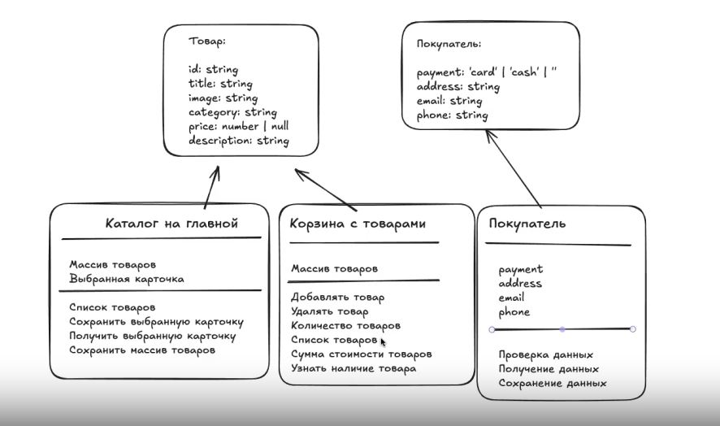

# Проектная работа "Веб-ларек"
https://github.com/nika-nova/weblarek

Стек: HTML, SCSS, TS, Vite

Структура проекта:
- src/ — исходные файлы проекта
- src/components/ — папка с JS компонентами
- src/components/base/ — папка с базовым кодом

Важные файлы:
- index.html — HTML-файл главной страницы
- src/types/index.ts — файл с типами
- src/main.ts — точка входа приложения
- src/scss/styles.scss — корневой файл стилей
- src/utils/constants.ts — файл с константами
- src/utils/utils.ts — файл с утилитами

## Установка и запуск
Для установки и запуска проекта необходимо выполнить команды

```
npm install
npm run dev
```

или

```
yarn
yarn dev
```
## Сборка

```
npm run build
```

или

```
yarn build
```
# Интернет-магазин «Web-Larёk»
«Web-Larёk» — это интернет-магазин с товарами для веб-разработчиков, где пользователи могут просматривать товары, добавлять их в корзину и оформлять заказы. Сайт предоставляет удобный интерфейс с модальными окнами для просмотра деталей товаров, управления корзиной и выбора способа оплаты, обеспечивая полный цикл покупки с отправкой заказов на сервер.

## Архитектура приложения

Код приложения разделен на слои согласно парадигме MVP (Model-View-Presenter), которая обеспечивает четкое разделение ответственности между классами слоев Model и View. Каждый слой несет свой смысл и ответственность:

Model - слой данных, отвечает за хранение и изменение данных.  
View - слой представления, отвечает за отображение данных на странице.  
Presenter - презентер содержит основную логику приложения и  отвечает за связь представления и данных.

Взаимодействие между классами обеспечивается использованием событийно-ориентированного подхода. Модели и Представления генерируют события при изменении данных или взаимодействии пользователя с приложением, а Презентер обрабатывает эти события используя методы как Моделей, так и Представлений.

### Базовый код

#### Класс Component
Является базовым классом для всех компонентов интерфейса.
Класс является дженериком и принимает в переменной `T` тип данных, которые могут быть переданы в метод `render` для отображения.

Конструктор:  
`constructor(container: HTMLElement)` - принимает ссылку на DOM элемент за отображение, которого он отвечает.

Поля класса:  
`container: HTMLElement` - поле для хранения корневого DOM элемента компонента.

Методы класса:  
`render(data?: Partial<T>): HTMLElement` - Главный метод класса. Он принимает данные, которые необходимо отобразить в интерфейсе, записывает эти данные в поля класса и возвращает ссылку на DOM-элемент. Предполагается, что в классах, которые будут наследоваться от `Component` будут реализованы сеттеры для полей с данными, которые будут вызываться в момент вызова `render` и записывать данные в необходимые DOM элементы.  
`setImage(element: HTMLImageElement, src: string, alt?: string): void` - утилитарный метод для модификации DOM-элементов ``


#### Класс Api
Содержит в себе базовую логику отправки запросов.

Конструктор:  
`constructor(baseUrl: string, options: RequestInit = {})` - В конструктор передается базовый адрес сервера и опциональный объект с заголовками запросов.

Поля класса:  
`baseUrl: string` - базовый адрес сервера  
`options: RequestInit` - объект с заголовками, которые будут использованы для запросов.

Методы:  
`get(uri: string): Promise<object>` - выполняет GET запрос на переданный в параметрах ендпоинт и возвращает промис с объектом, которым ответил сервер  
`post(uri: string, data: object, method: ApiPostMethods = 'POST'): Promise<object>` - принимает объект с данными, которые будут переданы в JSON в теле запроса, и отправляет эти данные на ендпоинт переданный как параметр при вызове метода. По умолчанию выполняется `POST` запрос, но метод запроса может быть переопределен заданием третьего параметра при вызове.  
`handleResponse(response: Response): Promise<object>` - защищенный метод проверяющий ответ сервера на корректность и возвращающий объект с данными полученный от сервера или отклоненный промис, в случае некорректных данных.

#### Класс EventEmitter
Брокер событий реализует паттерн "Наблюдатель", позволяющий отправлять события и подписываться на события, происходящие в системе. Класс используется для связи слоя данных и представления.

Конструктор класса не принимает параметров.

Поля класса:  
`_events: Map<string | RegExp, Set<Function>>)` -  хранит коллекцию подписок на события. Ключи коллекции - названия событий или регулярное выражение, значения - коллекция функций обработчиков, которые будут вызваны при срабатывании события.

Методы класса:  
`on<T extends object>(event: EventName, callback: (data: T) => void): void` - подписка на событие, принимает название события и функцию обработчик.  
`emit<T extends object>(event: string, data?: T): void` - инициализация события. При вызове события в метод передается название события и объект с данными, который будет использован как аргумент для вызова обработчика.  
`trigger<T extends object>(event: string, context?: Partial<T>): (data: T) => void` - возвращает функцию, при вызове которой инициализируется требуемое в параметрах событие с передачей в него данных из второго параметра.


### Данные  
В проекте используются:
- 3 интерфейса для представления данных о товаре и покупателе, а также об ошибках валидации.
- 3 класса для хранения и работы с данными


#### Интерфейсы

Продукт - элемент списка карточек на главном экране / модального окна / корзины  
`interface IProduct {`  
`  id: string;`  
`  description: string;`  
`  image: string;`  
`  title: string;`  
`  category: string;`  
`  price: number | null;`  
`}`

Покупатель - данные заполняются в форме оформления заказа  
`interface IBuyer {`  
`  payment: TPayment | null`  
`  email: string | null;`  
`  phone: string | null;`  
`  address: string | null;`  
`}`

Ошибки валидации - информирование о необходимости заполнить данные  
`interface ValidationErrors {`  
`  payment?: string;`  
`  address?: string;`  
`  phone?: string;`  
`  email?: string;`  
`}`

### Модели данных

#### Класс Products
Хранит базовую логику работы с массивом товаров.

Конструктор:  
`constructor(event: IEvents)` - принимает брокер событий

Поля класса:  
`products: IProduct[] = []` - хранит массив товаров  
`selectedProduct: IProduct | null = null` - хранит товар, выбранный для подробного отображения

Методы:  
`setProducts(products: IProduct[]): void` - сохранение массива товаров полученного в параметрах метода;  `getProducts(): IProduct[]` - получение массива товаров из модели;  
`getProductById(id: string): IProduct | undefined` - получение одного товара по его id;  
`setSelectedProduct(product: IProduct): void` - сохранение товара для подробного отображения;  
`getSelectedProduct(): IProduct | null` - получение товара для подробного отображения

#### Класс Cart
Реализует логику работы корзины - отображение выбранных товаров, удаление, отображение суммы, переход на оформление заказа.

Конструктор:  
`constructor(event: IEvents)` - принимает брокер событий

Поля класса:  
`items: IProduct[] = []` - хранит массив товаров, выбранных покупателем для покупки

Методы:  
`getItems(): IProduct[]` - получение массива товаров, которые находятся в корзине;  
`addItem(item: IProduct): void` - добавление товара, который был получен в параметре, в массив корзины;  
`removeItem(item: IProduct): void` - удаление товара, полученного в параметре из массива корзины;  
`clear(): void` - очистка корзины;  
`getTotalPrice(): number` - получение стоимости всех товаров в корзине;  
`getCount(): number` - получение количества товаров в корзине;  
`hasItem(id: string): boolean` - проверка наличия товара в корзине по его id, полученного в параметр метода

#### Класс Buyer
Реализует проверку и хранение данных о покупателе.

Конструктор:  
`constructor(event: IEvents)` - принимает брокер событий

Поля класса:  
`payment: 'card' | 'cash' | null = null` - хранит способ оплаты  
`address: string | null = null` - адреc  
`phone: string | null = null` - телефон  
`email: string | null = null` - email

Методы:  
`update(data: Partial<IBuyer>): void` - сохранение данных в модели. Один общий метод или отдельные методы для каждого поля. Важно учесть, что должна быть реализована возможность сохранить только одно значение, например, только адрес или только телефон, не удалив при этом значения других полей, которые уже могут храниться в классе;  
`get(): IBuyer` - получение всех данных покупателя;  
`clear(): void` - очистка данных покупателя;  
`validate(): ValidationErrors` - валидация данных. Поле является валидным, если оно не пустое.

### Слой коммуникации

#### Класс ApiService

Отвечает за получение данных данных о товарах с сервера и отправку данных о покупке на сервер.

Конструктор:  
`constructor(api: IApi)` - принимает объект, соответствующий интерфейсу IApi 

Поля класса:  
`api: IApi` - клиент для выполнения запросов

Методы:  
`getProducts(): Promise<IProductsResponse>` - получает с сервера массив товаров каталога;  
`async createOrder(order: IOrder): Promise<IOrderResponse>` - отправляет на сервер данные о заказе (покупатель + выбранные товары) и возвращает подтверждение покупки